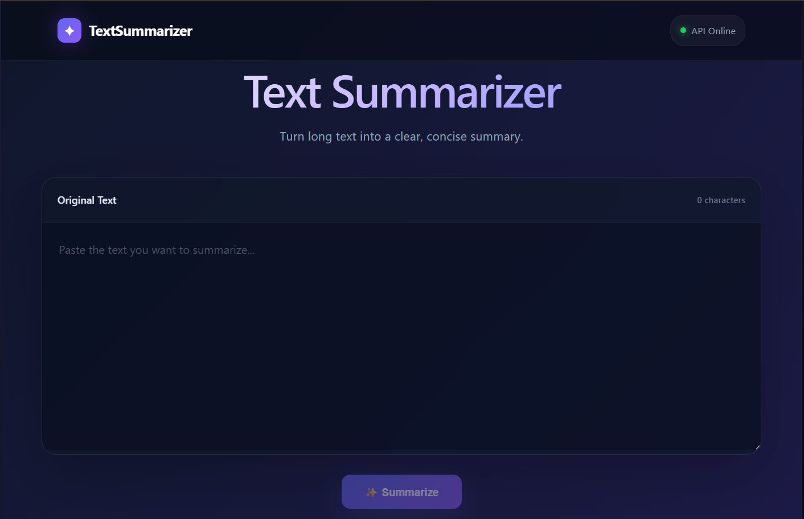
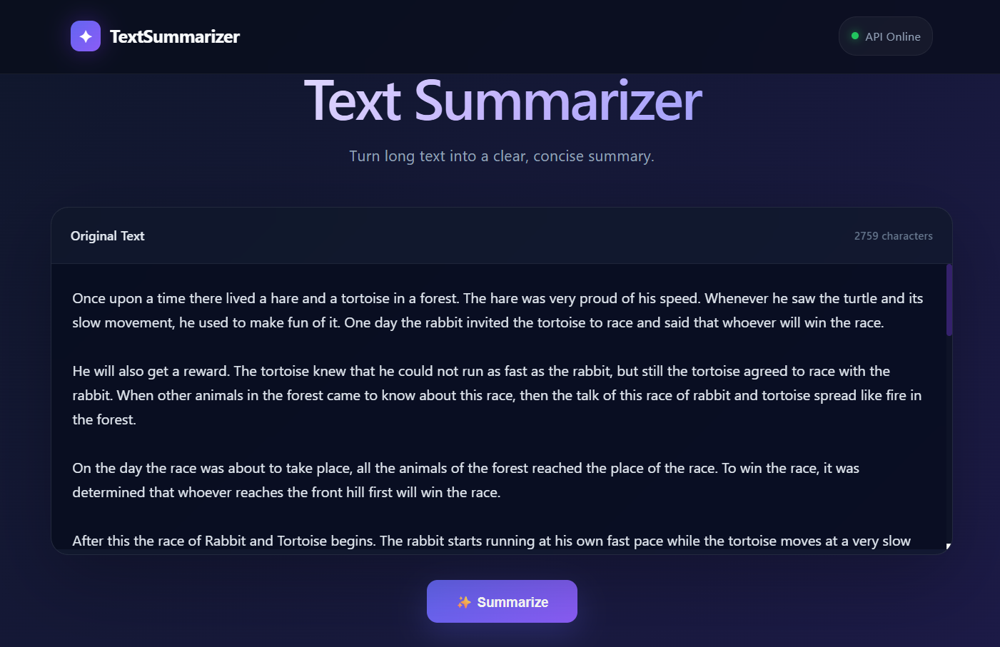
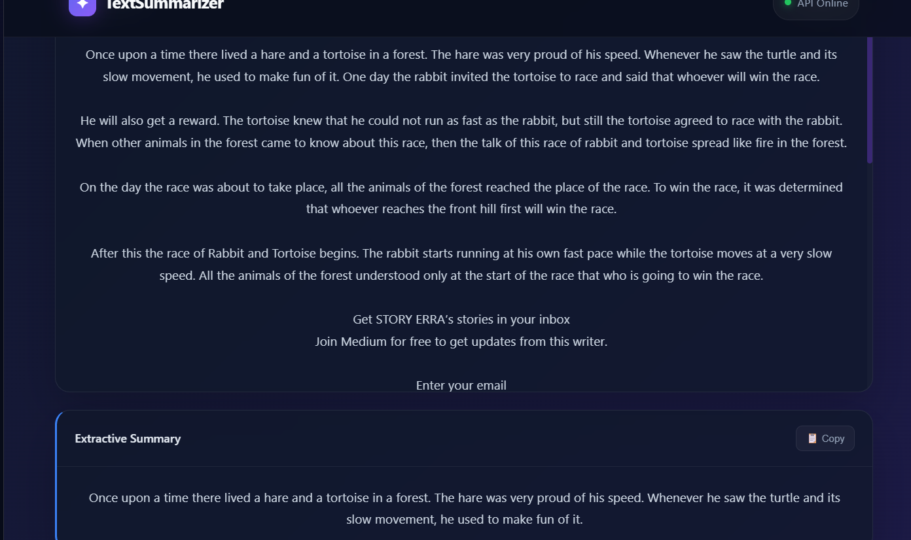
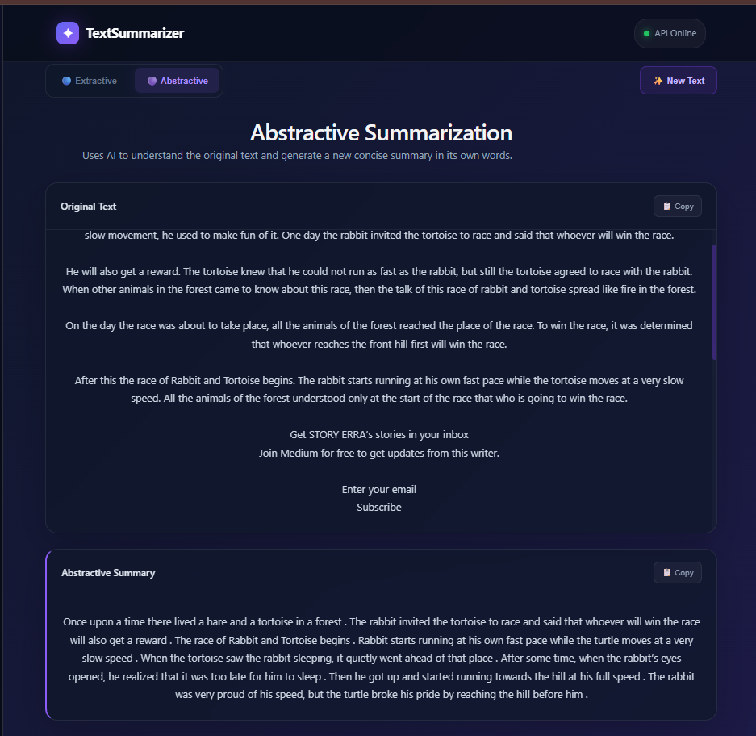

# Text Summarizer

An NLP-based text summarization application that generates concise summaries using **extractive and abstractive summarization techniques**.

The project explores multiple summarization approaches and transformer models to find a practical balance between **summary quality, model performance, and resource requirements**.



## Overview

The Text Summarizer project processes long-form text and generates shorter summaries while preserving the most important information.

The project implements two main approaches:

* **Extractive Summarization** using **TextRank**
* **Abstractive Summarization** using **Transformer-based models**

Several transformer models were explored during development. The models were compared based on summary quality, computational requirements, and practical deployment constraints.

After experimentation, **DistilBART (`sshleifer/distilbart-cnn-12-6`)** was selected as the final abstractive summarization model because it provided a practical balance between summarization quality and resource usage.

## Features

* Extractive summarization using TextRank
* Abstractive summarization using DistilBART
* Transformer-based text generation
* Text preprocessing
* Long-text summarization
* Web-based summarization interface
* Multiple model experimentation
* Docker containerization
* AWS deployment
* GitHub Actions CI/CD
* Nginx reverse proxy

## Tech Stack

### Programming & Frameworks

* Python
* Flask
* FastAPI
* HTML
* CSS
* JavaScript

### NLP & Machine Learning

* Natural Language Processing
* TextRank
* Hugging Face Transformers
* DistilBART
* PEGASUS
* PyTorch
* Scikit-learn

### DevOps & Cloud

* Docker
* AWS EC2
* Nginx
* GitHub Actions
* Git
* GitHub

## Summarization Architecture

```text
                    Input Text
                        │
                        ▼
                Text Preprocessing
                        │
                 ┌──────┴──────┐
                 │             │
                 ▼             ▼
            Extractive      Abstractive
           Summarization   Summarization
                 │             │
                 ▼             ▼
              TextRank      Transformer
                               Model
                 │             │
                 └──────┬──────┘
                        ▼
                Generated Summary
```

## Extractive Summarization

The extractive pipeline uses **TextRank** to identify and select important sentences from the original text.

TextRank is a graph-based ranking algorithm that ranks sentences according to their importance and relationship with other sentences.

### Extractive Workflow

```text
Input Text
    ↓
Sentence Tokenization
    ↓
Text Preprocessing
    ↓
Sentence Similarity
    ↓
TextRank
    ↓
Sentence Ranking
    ↓
Top Important Sentences
    ↓
Extractive Summary
```

### Advantages

* Preserves original sentences
* Does not require model training
* Lightweight compared with transformer models
* Useful for selecting important information from long documents

## Abstractive Summarization

The abstractive pipeline uses transformer-based sequence-to-sequence models to generate new summaries based on the meaning of the input text.

Unlike extractive summarization, the generated summary does not have to copy complete sentences from the original document.

### Abstractive Workflow

```text
Input Text
    ↓
Tokenization
    ↓
Transformer Encoder
    ↓
Context Representation
    ↓
Transformer Decoder
    ↓
Generated Summary
```

## Model Experimentation

During development, multiple transformer models were explored to find a suitable model for abstractive summarization.

The models were considered based on:

* Summary quality
* Generation speed
* Memory requirements
* Model size
* Deployment feasibility
* Resource consumption

### PEGASUS

**PEGASUS** was initially explored for abstractive summarization because it is specifically designed for summarization tasks.

However, experimentation with PEGASUS required significant computational resources and resulted in GPU memory limitations in the available environment.

Because of these resource constraints, another model was evaluated.

### DistilBART

The project was then moved to **DistilBART (`sshleifer/distilbart-cnn-12-6`)**.

DistilBART is a lighter version of BART that provides transformer-based abstractive summarization with lower resource requirements.

It was selected as the final model because it provided a practical balance between:

```text
Summary Quality
       +
Model Performance
       +
Memory Usage
       +
Deployment Feasibility
```

### Final Model

The final abstractive summarization implementation uses:

```text
Model:
sshleifer/distilbart-cnn-12-6
```

from the Hugging Face Transformers ecosystem.

The final pipeline uses the pretrained model for generating abstractive summaries.

> The model selection was based on practical experimentation and resource constraints rather than claiming that one model is universally more accurate than another.

## Model Comparison

| Model      | Approach    | Result / Observation                                                                      |
| ---------- | ----------- | ----------------------------------------------------------------------------------------- |
| TextRank   | Extractive  | Lightweight and useful for selecting important sentences                                  |
| PEGASUS    | Abstractive | Good summarization approach but high resource requirements in the development environment |
| DistilBART | Abstractive | Selected as the final model due to a practical balance between quality and resource usage |

## Summarization Workflow

```text
                  User Input
                      │
                      ▼
               Text Preprocessing
                      │
              ┌───────┴────────┐
              │                │
              ▼                ▼
          TextRank          DistilBART
              │                │
              ▼                ▼
       Extractive Summary  Abstractive Summary
              │                │
              └───────┬────────┘
                      ▼
                Final Output
```

## Requirements

* Python 3.9+
* Git
* pip
* Docker *(optional)*
* AWS account *(for cloud deployment)*

## Installation

### 1. Clone the Repository

```bash
git clone https://github.com/shaikhyder2312-dotcom/Text-Summarizer-Project.git
cd Text-Summarizer-Project
```

### 2. Create Virtual Environment

```bash
python -m venv venv
```

Activate the environment.

**Windows:**

```bash
venv\Scripts\activate
```

**Linux / macOS:**

```bash
source venv/bin/activate
```

### 3. Install Dependencies

```bash
pip install -r requirements.txt
```

## Run the Application

Start the application using:

```bash
python app.py
```

Then open the local application URL displayed by the application.

## Screenshots

### Text Summarizer Interface


### Input Text



### Generated Summary






## Project Structure

```text
Text-Summarizer-Project/
│
├── .github/
│   └── workflows/
│
├── config/
├── frontend/
├── research/
├── src/
│   └── textSummarizer/
│
├── Screenshots/
│
├── app.py
├── main.py
├── params.yaml
├── requirements.txt
├── requirements-prod.txt
├── setup.py
├── template.py
├── Dockerfile
├── .dockerignore
├── .gitignore
├── LICENSE
└── README.md
```

## API / Application Flow

The application follows a simple request and response workflow:

```text
User
 ↓
Frontend
 ↓
Backend API
 ↓
Text Processing
 ↓
Summarization Pipeline
 ↓
Transformer / TextRank
 ↓
Generated Summary
 ↓
Frontend
 ↓
User
```

## Docker

The application includes a Dockerfile for containerized deployment.

### Build Docker Image

```bash
docker build -t text-summarizer .
```

### Run Docker Container

```bash
docker run -p 8000:8000 text-summarizer
```

### Check Container

```bash
docker ps
```

### View Logs

```bash
docker logs <container_name>
```

## AWS Deployment

The application was deployed using **Docker on an AWS EC2 instance**.

### Deployment Architecture

```text
GitHub Repository
       │
       ▼
GitHub Actions
       │
       ▼
Docker Build
       │
       ▼
Docker Image
       │
       ▼
AWS EC2
       │
       ▼
Docker Container
       │
       ▼
Application
       │
       ▼
Nginx
       │
       ▼
User
```

## Nginx Reverse Proxy

Nginx was used as a reverse proxy in front of the application.

```text
Internet
    │
    ▼
Nginx
    │
    ▼
Docker Container
    │
    ▼
Application
```

Nginx receives incoming requests and forwards them to the application running inside the Docker container.

Example configuration:

```nginx
server {
    listen 80;
    server_name _;

    location / {
        proxy_pass http://127.0.0.1:8000;

        proxy_set_header Host $host;
        proxy_set_header X-Real-IP $remote_addr;
        proxy_set_header X-Forwarded-For $proxy_add_x_forwarded_for;
        proxy_set_header X-Forwarded-Proto $scheme;
    }
}
```

## CI/CD Pipeline

GitHub Actions was used to automate the build and deployment workflow.

```text
Developer
    │
    ▼
Git Push
    │
    ▼
GitHub Actions
    │
    ▼
Build Docker Image
    │
    ▼
Deploy to AWS EC2
    │
    ▼
Run Docker Container
    │
    ▼
Application
```

This provides a repeatable workflow for building and deploying the application.

## Troubleshooting

### Dependency Issues

Install the required dependencies:

```bash
pip install -r requirements.txt
```

### Docker Issues

Check all containers:

```bash
docker ps -a
```

View logs:

```bash
docker logs <container_name>
```

### Port Issues

Make sure the correct application port is mapped:

```bash
docker run -p 8000:8000 text-summarizer
```

### Nginx Issues

Test the configuration:

```bash
sudo nginx -t
```

Restart Nginx:

```bash
sudo systemctl restart nginx
```

## Limitations

* Summary quality depends on the input text and selected model.
* Transformer models require more computational resources than extractive approaches.
* Very long documents may require preprocessing or chunking.
* Generated summaries may occasionally omit important details.
* Model performance can vary depending on the type and length of the input text.

## Future Enhancements

* Improve transformer model evaluation
* Add ROUGE-based evaluation
* Compare additional summarization models
* Support PDF and DOCX files
* Add adjustable summary length
* Add multilingual summarization
* Add batch summarization
* Improve long-document handling
* Add automated model evaluation
* Improve CI/CD testing
* Add HTTPS support
* Add application monitoring

## License

This project is licensed under the **MIT License**.

See the [LICENSE](LICENSE) file for more information.

## Author

**Shaik Hyder Ali**

GitHub:
https://github.com/shaikhyder2312-dotcom
